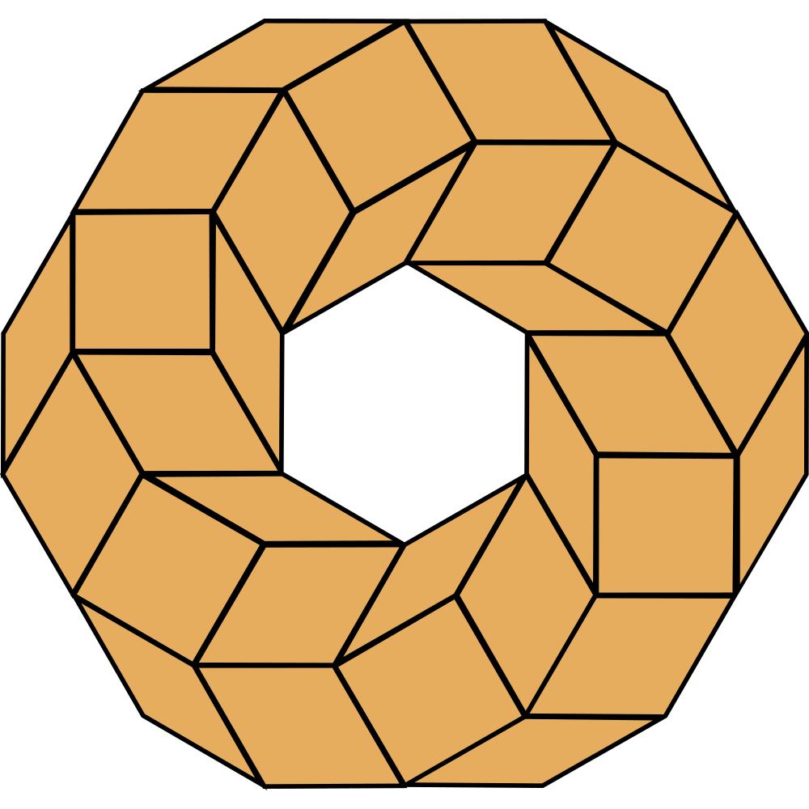

<div align="center">
  <picture>
    <source media="(prefers-color-scheme: dark)" srcset="public/brand/resonance/logo.svg" />
    
  </picture>

  <p align="center">
    
    
    
    
    
    
  </p>

  <p align="center">
    
    
    
  </p>

  <p align="center">
    <b>Conference hub for the Intuition ecosystem's Spaces, talks and AMAs</b><br>
    <i>The ideas from each Space, distilled, so they resonate beyond the live room.</i><br>
    Repository · <a href="https://github.com/intuition-box/Resonance">intuition-box/Resonance</a>
  </p>
</div>

---

## What it is

A Next.js (App Router) portal that synthesizes recorded & locally-transcribed conferences. Per
conference: context, speakers, themes, bounty missions and glossary.

## Language: English only

The site ships in **English only**. Non-English visitors rely on their browser's built-in
translation, which works reliably because every page is served with a static `<html lang="en">`
over real DOM text.

- **UI strings** live in `src/lib/dictionaries.ts` (a single English `dictionary` object).
- **Content** fields are plain English `string`s (see `src/data/types.ts`). No translation object,
  no `loc()` helper.
- Routing is clean and locale-free: pages live directly under `src/app/` (no `/[lang]` prefix).

## Routes

| Route | Content |
|-------|---------|
| `/` | **Hub**: all conferences (cards + search) |
| `/contribute` | **Contribute** guide (how to open a PR) |
| `/c/[slug]` | Conference overview |
| `/c/[slug]/{speakers,themes,missions,glossary}` | Sections (rendered if data present) |

## Contributing: PR only

Conferences are **hardcoded** and contributed via **GitHub pull request** at
[intuition-box/Resonance](https://github.com/intuition-box/Resonance): no account, no database,
no web import. Maintainer review is the quality/anti-spam gate.

1. Transcribe the audio/video and synthesize the content.
2. Create a folder `src/data/conferences/<slug>/` (one file per part: `meta`, `orgs`, `speakers`,
   `themes`, `missions`, `glossary`) exporting a `Conference`. A single `<slug>.ts` also works for
   a short one.
3. Register it in the array in `src/data/conferences/index.ts`.
4. Open a PR. Use `semantic-delegation/` as the reference.

**Everything adapts automatically — only fill what the conference actually has.**

- **Required**: `slug`, `meta` (title, platform, date, durationLabel, oneLiner, tags), `orgs`,
  `speakers`, `themes`.
- **Optional** (rendered only if present): `bounties`/`missions`, `glossary`, `partLabels`,
  speaker `avatar`/`handle`/`x`, org `x`, `meta.idea`/`note`/`announcementUrl`, `cover`.
- **Every text field is a plain English `string`** (browsers handle translation for other languages).
- **Platform is free text** (`meta.platform`): X Space, Discord stage, YouTube talk, AMA… anything.
- **Social preview (OG)**: a branded card is **generated on the fly** from the data
  (`/api/og/<slug>`: Intuition lockup, title, speaker avatars, bounty) — **no image to provide**.
  Set `meta.ogImage` only to override it with a specific image; `cover` is for the on-page
  hero/thumbnail, not the share preview.

## Deployment

Containerized via `output: "standalone"` (`next.config.mjs`). Built for **Coolify**, deployed at
**[resonance.intuition.box](https://resonance.intuition.box)**. No environment variables required.
Coolify can build with Nixpacks (Next.js)
or a standard standalone Dockerfile.

## Development

```bash
pnpm install
pnpm dev            # http://localhost:3000
pnpm build          # production build
pnpm lint           # Biome
```

## Sources (Semantic Delegation)

- Data: `src/data/conferences/semantic-delegation/` (English).

> ⚠️ Speaker names were normalized from the audio transcription: Ryan McPeck · Kames · Zet · Saulo · Jordan.
